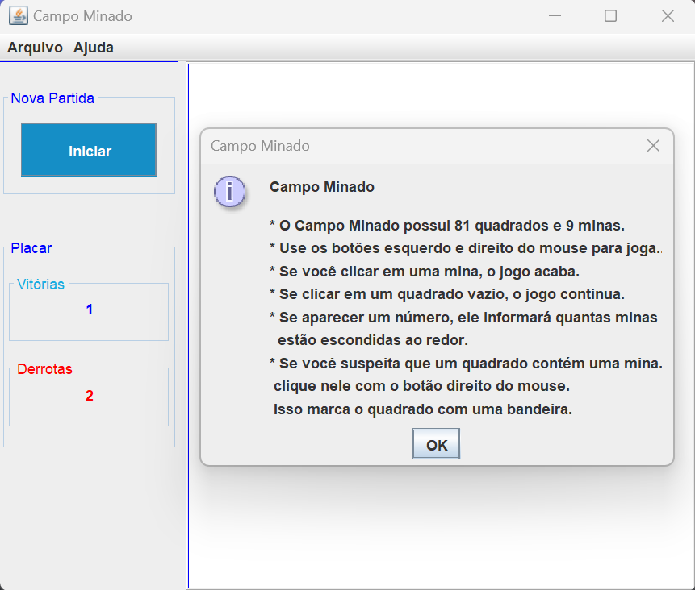
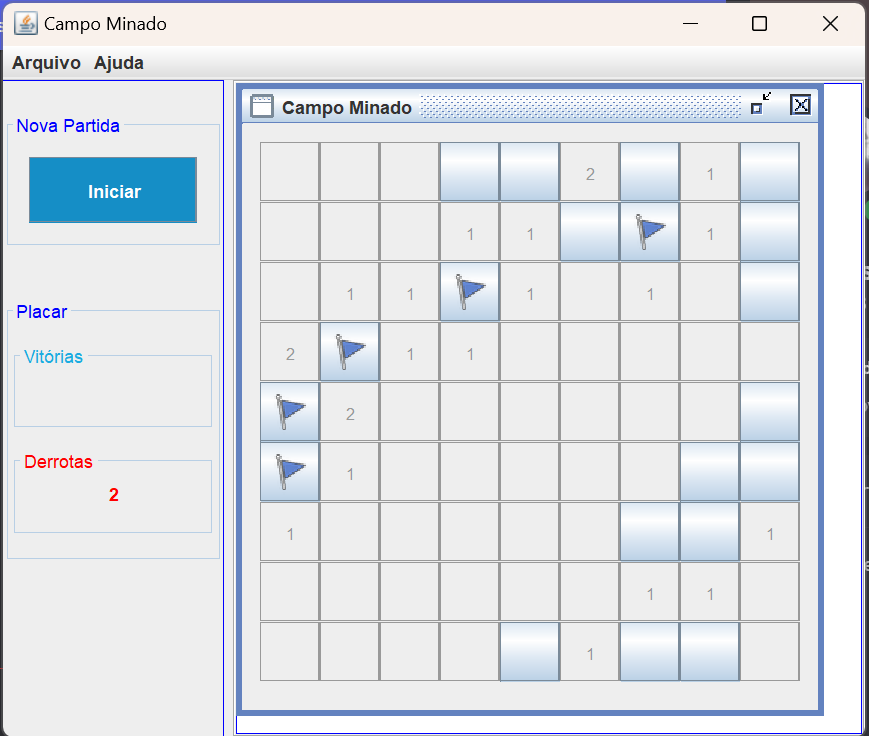
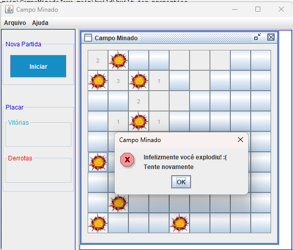
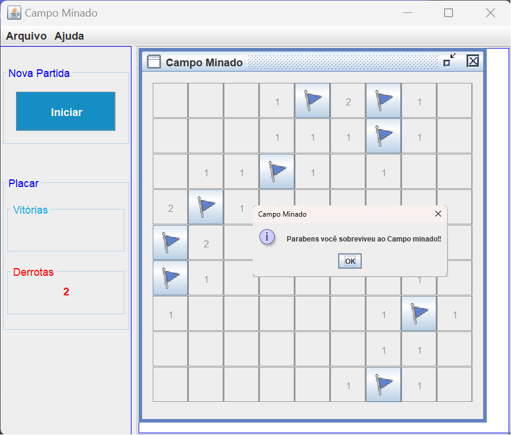

# CampoMinadoJava
:bomb: Jogo campo minado feito em Java com interface gráfica Swing

- O Jogo possui contagem de vitórias e derrotas, geração aleatória de minas, marcação com bandeirinhas.
- Use os botões do mouse para jogar.

# Instruções

- Você pode acessar as instruções no menu Ajuda.

# Marcando espaços suspeitos

- Você pode adicionar uma bandeirinha com o botão direito do mouse, assim indica que o espaço marcado pode ser uma bomba e ao clicar com o botão esquerdo a bomba não é ativada.
- Ao redor de cada espaço possui um número indicando quantas bombas existem em cima, em baixo ou nos lados. 

# Encontrando uma mina

- Ao encontrar uma mina com o botão esquerdo do mouse ela explodirá revelando a existência das outras minas e você perderá a partida atual.

# Vencendo a partida

- Se você clicar em todos os espaços sem ativar em nenhumas das 9 minas espalhadas no campo você vencerá a partida!

